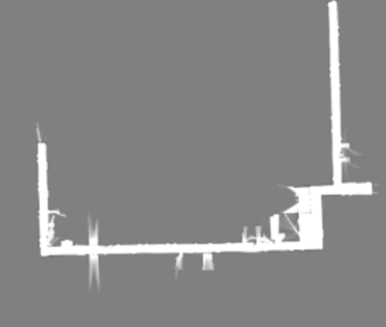
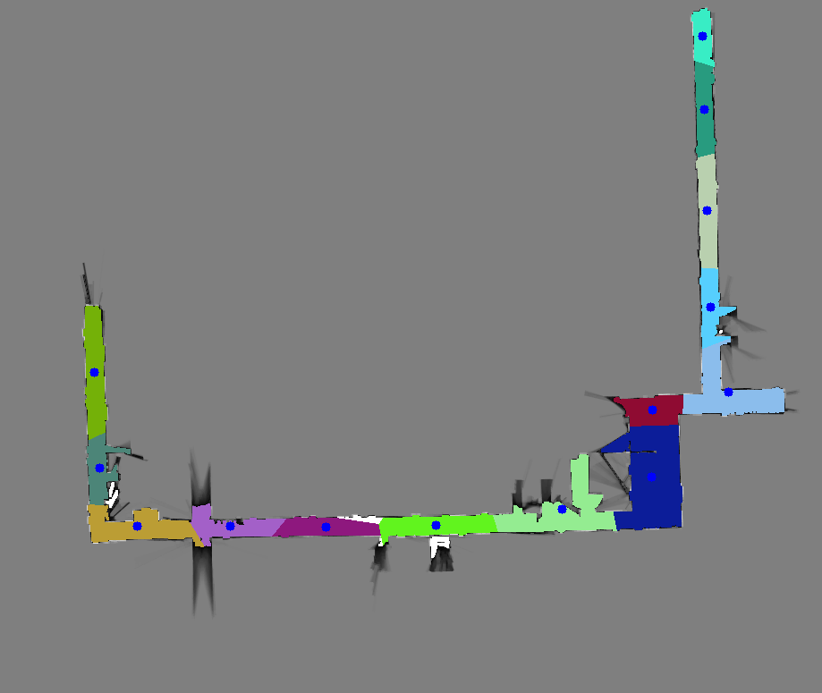

# auto_room_segmentation
automated_room segmentation with SLIC algorithm 


## Requirements
```
$ pip install opencv-python
$ pip install opencv-contrib-python
```


## Usage
```
$ python run_auto_seg.py --img_path <input_image_path> --n_segments <number_of_segments> --min_area <minimum_segment_area> --output <output_image_path>
```


- input map:


- output map:


- output centroids:
`./centroids.json`
```
"roomX": {
        "x": 785.0,
        "y": 40.0
    },
```